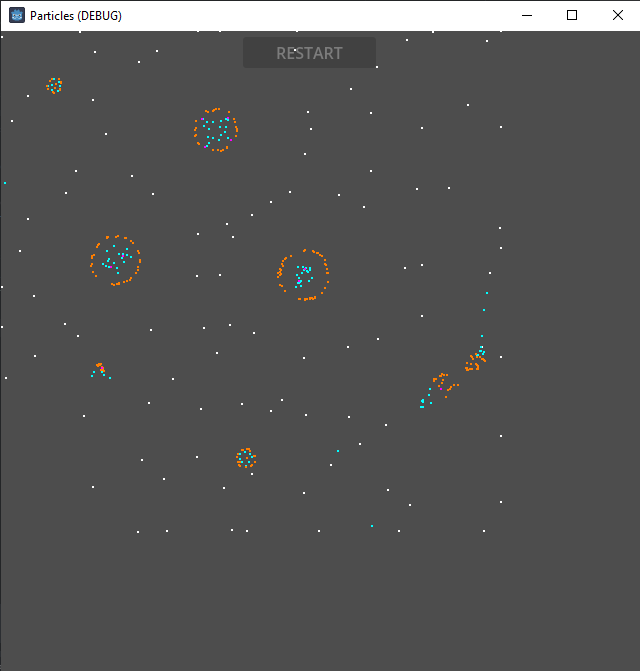
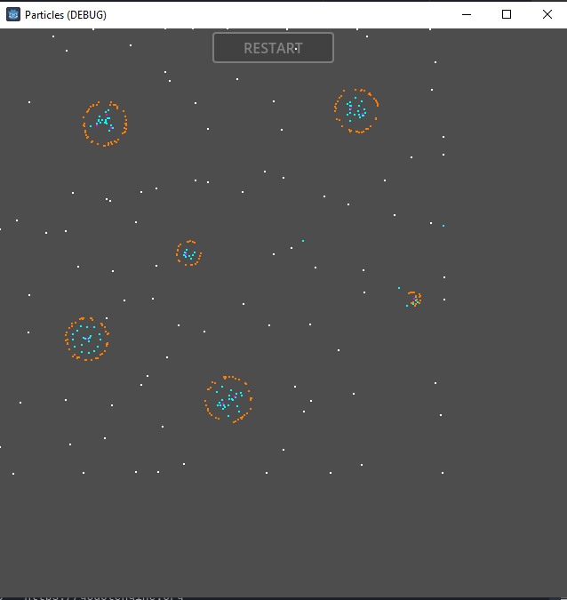
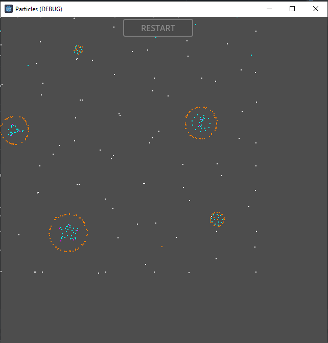
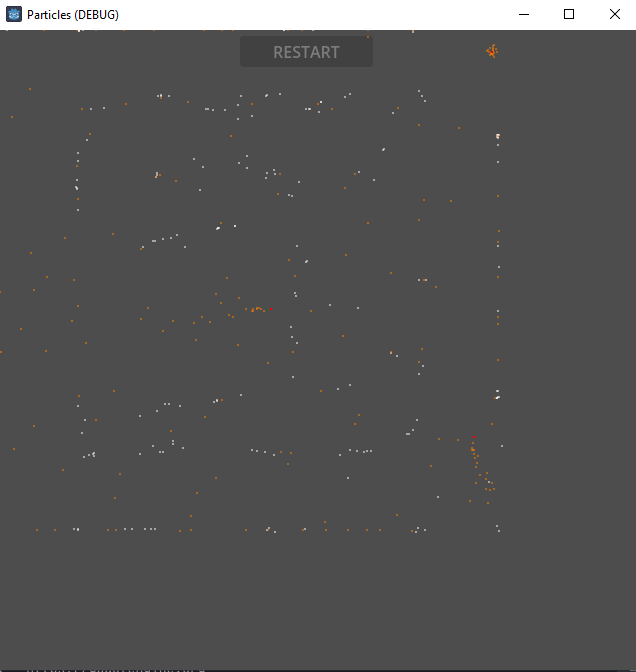

# Living Particles  
Made with Godot Engine v4.2.1.stable.official.b09f793f5 - https://godotengine.org
based in [this video](https://youtu.be/0Kx4Y9TVMGg) and [this repository](https://github.com/hunar4321/particle-life)

Please note that this is just an experiment to see how well Godot can handle this type of simulation, as performance is the most important factor here. The better the performance, the better the simulation.

# Screenshots

